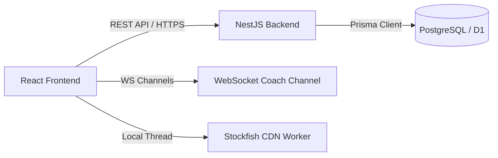
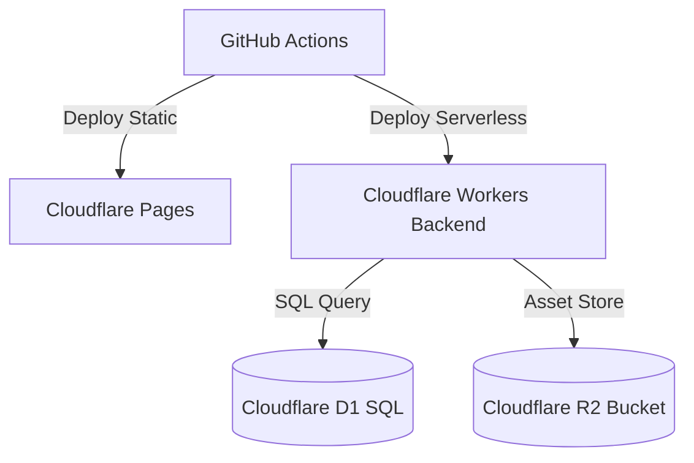

# Architecture Specification — ChessOS Pro

## 1. System Components
ChessOS Pro is designed as a modular monorepo containing a high-performance React frontend and a robust NestJS backend.

### 1.1 Frontend Layout
- **React App:** Serves the primary user interface. Single-Page Application driven by client routing.
- **Zustand Store:** Holds globally accessible, reactive state slices (Auth, Board State, Progress Indicators).
- **Board Renderer (SVG):** Custom drawing pipeline supporting coordinate labels, move indicators, and animated overlay SVGs (dashed laser lines for pins, glowing ripples for forks).
- **Stockfish Service:** Worker thread running in background to evaluate positions and pv moves asynchronously.

### 1.2 Backend API Services
- **NestJS Gateway:** Directs HTTP requests to corresponding modules.
- **Prisma Client:** Performs database queries to PostgreSQL (local/production) or Cloudflare D1 (edge).
- **JWT Guard:** Intercepts incoming requests to verify identity and permissions.

---

## 2. Infrastructure & Deployment Model

### 2.1 Edge Deployment on Cloudflare
- **Frontend Hosting:** Cloudflare Pages hosts the compiled static React build folder (`dist/`).
- **Edge API Gateway:** Backend runs inside Cloudflare Workers or serverless NestJS nodes.
- **Edge DB:** Cloudflare D1 stores SQL data globally close to the user client.
- **Asset Storage:** Cloudflare R2 serves as the asset storage bucket for game studies and user profile configurations.
