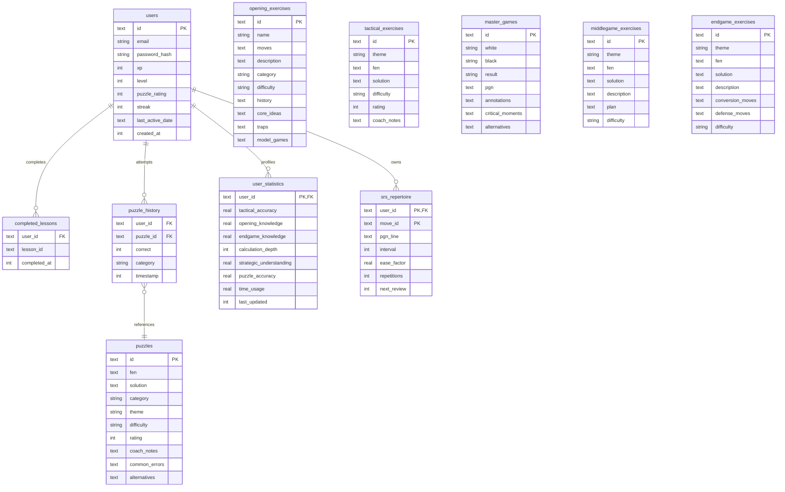

# Database Schema Specification — ChessOS Pro

This document defines the relational schema for the ChessOS Pro Edge Database (Cloudflare D1 SQLite). The database houses user statistics, curriculum progress, spaced repetition intervals, tactical puzzles, master games, and positional exercises.

## 1. Relational Entity ER Diagrams

---

## 2. Table Specifications & Column Layouts

### 2.1 `users`
Represents the credentials and core gamified progress of a student.
- `id` (TEXT, PK): Unique client identifier.
- `email` (TEXT): Unique authentication address.
- `password_hash` (TEXT): Double-hashed credential (SHA-256 with salt).
- `xp` (INTEGER): Total accumulated learning experience points.
- `level` (INTEGER): Calculated student level.
- `puzzle_rating` (INTEGER): Live puzzle solver rating (Glicko/Elo equivalent).
- `streak` (INTEGER): Consecutive daily active streak count.
- `last_active_date` (TEXT): String representation of the last date of deliberate practice (YYYY-MM-DD).
- `created_at` (INTEGER): Unix epoch timestamp of account creation.

### 2.2 `completed_lessons`
Maps completed foundational and curriculum lessons for students.
- `user_id` (TEXT, FK): Link to `users.id`.
- `lesson_id` (TEXT): Unique lesson index identifier.
- `completed_at` (INTEGER): Completion Unix epoch timestamp.

### 2.3 `puzzle_history`
Maintains records of puzzle solving attempts for strength profiling.
- `user_id` (TEXT, FK): Link to `users.id`.
- `puzzle_id` (TEXT): ID of puzzle attempted.
- `correct` (INTEGER): 1 if solved correctly on first try, 0 otherwise.
- `category` (TEXT): Tactical category label (forks, pins, etc.).
- `timestamp` (INTEGER): Submission Unix epoch timestamp.

### 2.4 `puzzles`
Holds the bank of 10,010+ curated exercises.
- `id` (TEXT, PK): Unique puzzle code.
- `fen` (TEXT): Forsyth-Edwards Notation of starting position.
- `solution` (TEXT): JSON array of string moves (e.g. `["d5e6", "f7e6", "e5g6"]`).
- `category` (TEXT): Main tactical group.
- `theme` (TEXT): Specific motif name.
- `difficulty` (TEXT): Beginner, Intermediate, or Advanced.
- `rating` (INTEGER): Base tactical rating.
- `coach_notes` (TEXT): Advice for the deliberate practice coach panel.
- `common_errors` (TEXT): JSON array of common errors.
- `alternatives` (TEXT): JSON array of alternative candidate move evaluations.

### 2.5 `opening_exercises`
Opening lines, history, and spaced repetition templates.
- `id` (TEXT, PK): Unique opening identifier.
- `name` (TEXT): Short name (e.g., "Sicilian Defense").
- `moves` (TEXT): JSON array of opening line moves.
- `description` (TEXT): Strategic overview of the line.
- `category` (TEXT): Open, Semi-Open, Closed, or Flank.
- `difficulty` (TEXT): Beginner, Intermediate, or Advanced.
- `history` (TEXT): Contextual background.
- `core_ideas` (TEXT): Strategic middle-game transition ideas.
- `traps` (TEXT): Mapped traps and typical blunders.
- `model_games` (TEXT): JSON list of notable Grandmaster games playing this line.

### 2.6 `tactical_exercises`
Individual thematic tactical exercises.
- `id` (TEXT, PK): Unique exercise identifier.
- `theme` (TEXT): fork, pin, skewer, etc.
- `fen` (TEXT): Starting position FEN.
- `solution` (TEXT): JSON sequence of correct moves.
- `difficulty` (TEXT): Level of tactical sight required.
- `rating` (INTEGER): Tactical weight.
- `coach_notes` (TEXT): Visual overlay hints.

### 2.7 `master_games`
Annotated classical games of historical grandmasters.
- `id` (TEXT, PK): Unique game code.
- `white` (TEXT): White player name.
- `black` (TEXT): Black player name.
- `result` (TEXT): Game result (e.g., `1-0`, `0-1`, `1/2-1/2`).
- `pgn` (TEXT): Full Portable Game Notation string.
- `annotations` (TEXT): JSON object mapping ply index to coach commentary.
- `critical_moments` (TEXT): JSON array marking move indices requiring guess-the-move action.
- `alternatives` (TEXT): JSON array of alternative variations for study.

### 2.8 `middlegame_exercises`
Drills focusing on outposts, space, open files, and prophylaxis.
- `id` (TEXT, PK): Unique code.
- `theme` (TEXT): Category of middlegame advantage.
- `fen` (TEXT): Base position.
- `solution` (TEXT): JSON moves sequence.
- `description` (TEXT): Theoretical text of strategic objective.
- `plan` (TEXT): Master plan explanation.
- `difficulty` (TEXT): Level of strategic sight.

### 2.9 `endgame_exercises`
Theoretical endgames (Lucena, Philidor, Opposition).
- `id` (TEXT, PK): Unique endgame ID.
- `theme` (TEXT): King Opposition, Triangulation, Rook Endgame, etc.
- `fen` (TEXT): FEN representation.
- `solution` (TEXT): JSON moves.
- `description` (TEXT): Detailed theory description.
- `conversion_moves` (TEXT): JSON expected moves for attacking playout.
- `defense_moves` (TEXT): JSON expected moves for defensive playout.
- `difficulty` (TEXT): Tactical classification.

### 2.10 `user_statistics`
Computed deliberate practice profiles dynamically evaluated for custom learning plan schedules.
- `user_id` (TEXT, PK): Link to `users.id`.
- `tactical_accuracy` (REAL): Solver accuracy rate (0.0 to 1.0).
- `opening_knowledge` (REAL): Spaced review recall accuracy (0.0 to 1.0).
- `endgame_knowledge` (REAL): Playout conversion accuracy (0.0 to 1.0).
- `calculation_depth` (INTEGER): Maximum moves successfully visualised.
- `strategic_understanding` (REAL): Positional/Middlegame correct rate.
- `puzzle_accuracy` (REAL): Correct attempts / total attempts.
- `time_usage` (REAL): Average seconds spent per move.
- `last_updated` (INTEGER): Last evaluation Unix epoch timestamp.

### 2.11 `srs_repertoire`
Stores custom spaced repetition card settings for opening lines.
- `user_id` (TEXT, PK): Link to `users.id`.
- `move_id` (TEXT, PK): Unique move line code.
- `pgn_line` (TEXT): PGN representation of the line.
- `interval` (INTEGER): Days until next review.
- `ease_factor` (REAL): SM-2 ease multiplier.
- `repetitions` (INTEGER): Successful reviews count.
- `next_review` (INTEGER): Unix epoch timestamp of next review.
