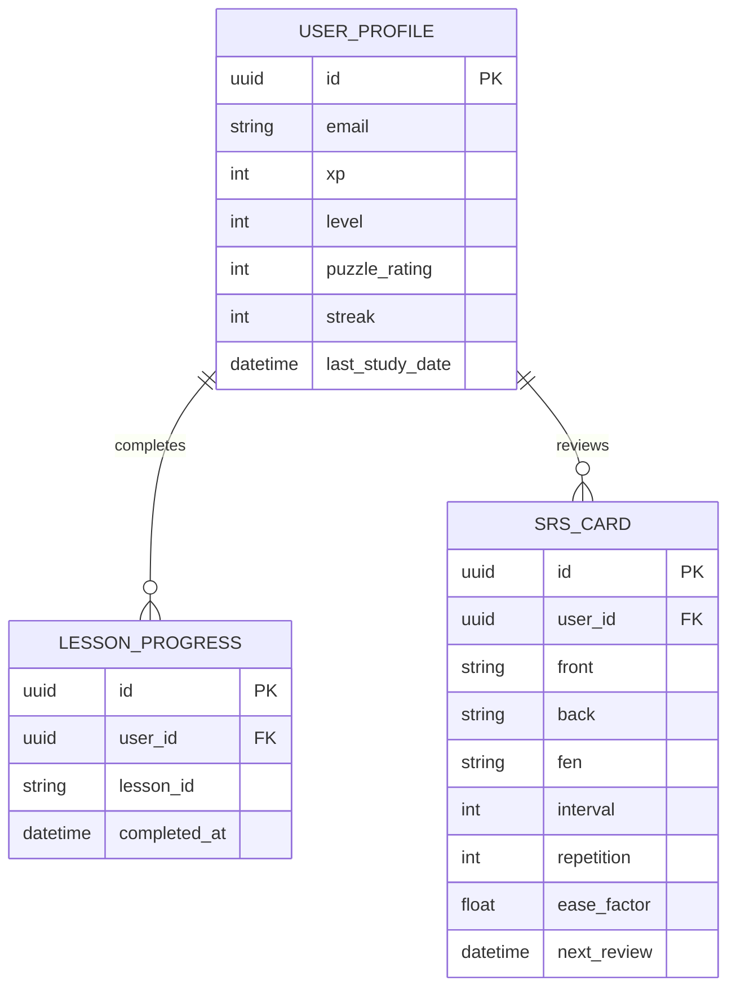

# Database Schema Specification — ChessOS Pro

## 1. Relational Entity ER Diagrams



---

## 2. DDL Database Schema Mapping

### User Profile Table
```sql
CREATE TABLE user_profiles (
    id UUID PRIMARY KEY DEFAULT gen_random_uuid(),
    email VARCHAR(255) UNIQUE NOT NULL,
    xp INTEGER DEFAULT 0,
    level INTEGER DEFAULT 1,
    puzzle_rating INTEGER DEFAULT 800,
    streak INTEGER DEFAULT 0,
    last_study_date DATE,
    created_at TIMESTAMP DEFAULT CURRENT_TIMESTAMP
);
```

### Lesson Progress Table
```sql
CREATE TABLE lesson_progress (
    id UUID PRIMARY KEY DEFAULT gen_random_uuid(),
    user_id UUID REFERENCES user_profiles(id) ON DELETE CASCADE,
    lesson_id VARCHAR(100) NOT NULL,
    completed_at TIMESTAMP DEFAULT CURRENT_TIMESTAMP,
    UNIQUE(user_id, lesson_id)
);
```

### Spaced Repetition Cards Table (SM-2 Scheduling)
```sql
CREATE TABLE srs_cards (
    id UUID PRIMARY KEY DEFAULT gen_random_uuid(),
    user_id UUID REFERENCES user_profiles(id) ON DELETE CASCADE,
    front TEXT NOT NULL,
    back TEXT NOT NULL,
    fen VARCHAR(100),
    interval INTEGER DEFAULT 1,
    repetition INTEGER DEFAULT 0,
    ease_factor REAL DEFAULT 2.5,
    next_review TIMESTAMP NOT NULL,
    created_at TIMESTAMP DEFAULT CURRENT_TIMESTAMP
);
```
