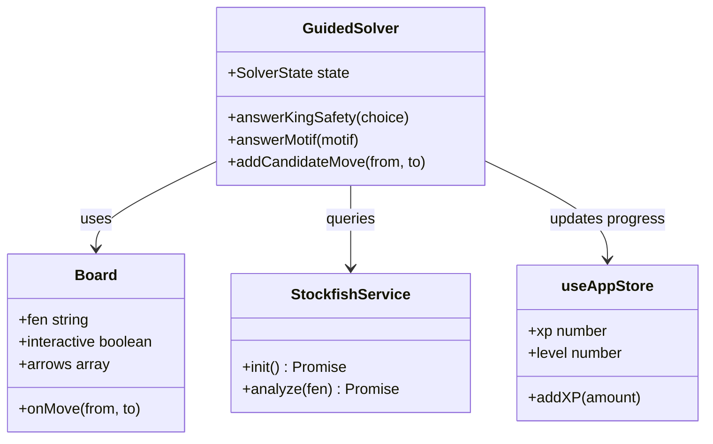

# Low-Level Design (LLD) — ChessOS Pro

## 1. Class Definitions & Core Interfaces

### 1.1 `GuidedSolver` Interface
Manages the 7-step GM thought process.

```typescript
export interface SolverState {
  kingSafety: 'White' | 'Black' | 'Equal' | null;
  motifsSelected: string[];
  overloadedPiece: string | null;
  candidates: CandidateMove[];
  opponentResponses: string[];
}

export interface CandidateMove {
  move: string;      // e.g. "Bxf7+"
  lan: string;       // e.g. "c4f7"
  rating: 'Excellent' | 'Interesting' | 'Too slow';
}

export class GuidedSolver {
  constructor(board: BoardRenderer, puzzle: Puzzle, options?: SolverOptions);
  
  public answerKingSafety(choice: string): boolean;
  public answerMotif(motif: string): boolean;
  public answerOverloaded(square: string): boolean;
  public addCandidateMove(from: string, to: string): void;
  public submitResponseMove(from: string, to: string): void;
  
  private _calculateAnswers(): void;
  private _countKingAreaAttackers(color: 'w' | 'b'): number;
  private _findOverloadedPiece(): string;
}
```

### 1.2 `StockfishService` Interface
Asynchronous worker gateway.

```typescript
export interface AnalysisResult {
  bestMove: string;
  lines: PVLine[];
}

export interface PVLine {
  depth: number;
  multipv: number;
  score: number;
  scoreType: 'cp' | 'mate';
  displayScore: string;
  pv: string[];
}

export class StockfishService {
  public init(): Promise<void>;
  public send(cmd: string): void;
  public stop(): void;
  public analyze(fen: string, depth?: number, onInfo?: (lines: PVLine[]) => void): Promise<AnalysisResult>;
}
```

---

## 2. Zustand Store Structuring

```typescript
interface AppStateStore {
  // Auth
  token: string | null;
  user: UserProfile | null;
  login: (token: string, profile: UserProfile) => void;
  logout: () => void;
  
  // Progress
  xp: number;
  level: number;
  completedLessons: string[];
  addXP: (amount: number) => void;
  completeLesson: (lessonId: string) => void;
  
  // Active Training states
  activePuzzle: Puzzle | null;
  setActivePuzzle: (p: Puzzle) => void;
}
```

---

## 3. Component Interactions Diagram



