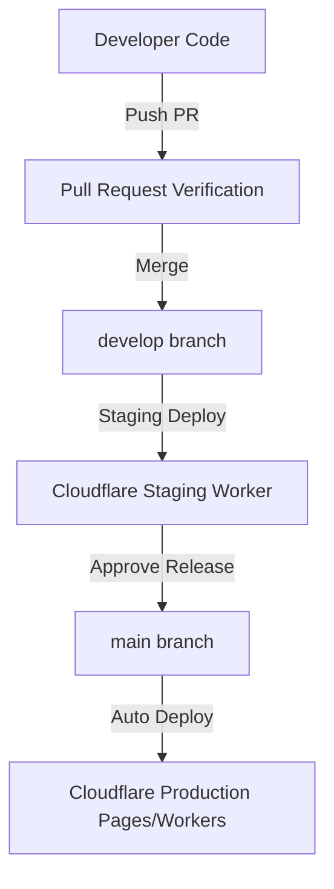

# Release Management Plan — ChessOS Pro

## 1. Versioning Policy
We utilize Semantic Versioning (SemVer 2.0.0):
- **MAJOR:** Incompatible API or structural changes.
- **MINOR:** Backward-compatible new features.
- **PATCH:** Backward-compatible bug fixes.

---

## 2. Git Branching Strategy
We enforce a strict branching protocol:
- **`main`:** Stable production code. Deployments to Cloudflare Pages occur automatically upon merges to `main`.
- **`develop`:** Active integration branch for the next release cycle.
- **`feature/*`:** Developer branches created from `develop` for specific features.
- **`hotfix/*`:** Urgent production patches created directly from `main`.

### Merge Authorization Rules
1. Pull Requests (PRs) targeting `develop` or `main` must pass all CI checks (linting, Vitest tests, Playwright audits).
2. Code reviews from at least one core engineer are required.
3. Test coverage metrics must meet or exceed the 90/95 thresholds.

---

## 3. Deployment Pipeline & Releases

### Staging Verification
Releases must pass manual sanity audits on the staging edge cluster before merging to the production branch.
