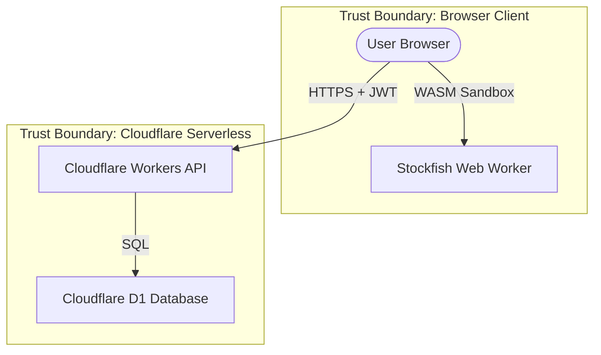

# ChessOS Pro — Security Threat Model

This document outlines the security architecture, threat profiling, trust boundaries, and mitigations for the ChessOS Pro platform, aligning with the STRIDE threat classification model.

---

## 1. System Architecture & Boundaries

The ChessOS Pro architecture consists of:
1. **Client-Side React SPA**: Runs entirely in the user's browser sandboxed environment. State is persisted in `localStorage` and managed with Zustand.
2. **Cloudflare Workers API**: Stateless edge computing handling business logic and request dispatching.
3. **Cloudflare D1 Database**: SQLite storage at the edge.
4. **Stockfish WASM Engine**: Runs inside a client-side Web Worker sandbox.

---

## 2. Trust Levels

| Asset | Trust Level | Description |
|---|---|---|
| User Input (FEN, Move coordinates) | Untrusted | Can be manipulated via browser console or intercepting proxy. |
| localStorage State | Untrusted | Directly accessible to users; easily modified to alter XP or rating. |
| JWT Tokens | Cryptographically Trusted | Signed by Cloudflare Workers secret; integrity is verified. |
| Cloudflare Workers Environment | Trusted | Secure serverless runtime isolated from other tenants. |
| Cloudflare D1 Database | Trusted | Encrypted at rest, only accessible via worker bindings. |

---

## 3. STRIDE Threat Analysis

### Spoofing (Identity)
*   **Threat**: An attacker attempts to forge API requests pretending to be another user.
*   **Mitigation**: JWT tokens are signed using high-entropy secrets configured in wrangler secrets. The worker rejects any requests missing a valid signature.

### Tampering (Data Integrity)
*   **Threat 1**: A user modifies local storage to change their XP from 100 to 100,000.
*   **Mitigation 1**: The client-side XP is treated as a presentation detail. Critical operations (e.g. tournament leaderboard positioning or official achievements) require syncing with the Cloudflare D1 backend, which acts as the system of record.
*   **Threat 2**: An attacker attempts SQL injection via the custom register/login/progress payloads.
*   **Mitigation 2**: Use parameter binding in all D1 query executions (`c.env.DB.prepare(...).bind(...)`). Dynamic SQL string concatenation is strictly prohibited.

### Repudiation
*   **Threat**: Users deny performing actions (e.g. claiming rewards or clearing modules).
*   **Mitigation**: D1 schema records timestamps (`completed_at`, `timestamp`) for all actions. Logs in Cloudflare log stream record worker invocation parameters.

### Information Disclosure
*   **Threat**: Exposure of user email addresses, password hashes, or progress metrics.
*   **Mitigation**:
    *   Passwords must never be stored in plaintext. Use secure PBKDF2 or bcrypt hashing if user auth is integrated at scale.
    *   All transit data is encrypted via TLS (forced HTTPS on Cloudflare Pages and Workers).
    *   Do not return password hashes in registration/login JSON outputs.

### Denial of Service
*   **Threat**: Exploiting D1 limits (free tier has query volume caps) through rapid API calls.
*   **Mitigation**: Cloudflare Workers rate limiting enables dropping requests exceeding 100 requests per minute per IP address.

### Elevation of Privilege
*   **Threat**: Standard users modifying other users' progress records.
*   **Mitigation**: The token payload contains the verified `userId`. Worker routes authorize changes only where the query parameter matches the user ID extracted from the authenticated JWT token.

---

## 4. Specific Chess Engine Threats

### Stockfish WASM Exploitation
*   **Threat**: Malicious FEN inputs attempting buffer overflow or remote code execution (RCE) inside the Stockfish compiled C/WASM binary.
*   **Mitigation**:
    *   The `chess.js` parser validates FEN syntax prior to initialization or engine execution, dropping malformed payloads.
    *   The engine runs within a Web Worker sandbox, isolated from the DOM, cookies, and local storage variables, preventing cross-site scripting (XSS) elevation if a buffer overflow occurs.
