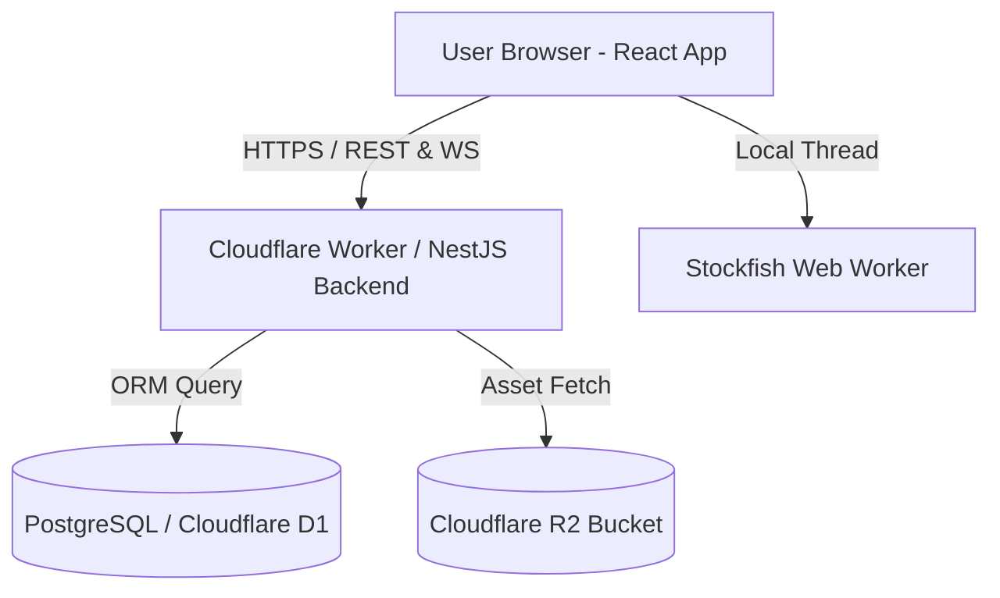

# ChessOS Enterprise — Full-Stack Redesign Plan

We are upgrading ChessOS from a client-only Vanilla JS SPA into a **production-grade, cloud-ready, enterprise-quality Chess Mastery Platform**. 

The platform will utilize a monorepo structure with a **React + TypeScript + Zustand + Tailwind** frontend, a **NestJS + PostgreSQL / Cloudflare D1** backend, and a comprehensive validation, testing, and documentation framework.

---

## Technical Architecture



### 1. Technology Stack
- **Frontend:** React 18, Vite, TypeScript, TailwindCSS, Zustand (State Management)
- **Backend:** NestJS, TypeScript, Node.js, Prisma ORM (database-agnostic)
- **Database:** PostgreSQL (local & enterprise), Cloudflare D1 (edge serverless)
- **Object Storage:** Cloudflare R2 (for storing game PGNs, player profile assets)
- **CI/CD:** GitHub Actions + Cloudflare Pages & Workers deployment
- **Testing:** Vitest (unit/integration), Playwright (E2E, visual regression, accessibility)

### 2. Workspace Directory Layout
```text
/
├── frontend/             # React + TS + Tailwind + Zustand
│   ├── src/
│   │   ├── components/   # Board, GuidedSolver, ReplayPanel, analytics graphs
│   │   ├── store/        # Zustand state stores (auth, board, progress)
│   │   └── main.tsx
│   ├── package.json
│   └── vite.config.ts
├── backend/              # NestJS Backend API
│   ├── src/
│   │   ├── modules/      # Auth, Puzzles, Lessons, AI-Coach, Analytics, Bots
│   │   └── main.ts
│   ├── prisma/           # Database schema & migrations
│   └── package.json
├── docs/                 # Full LLD, Architecture, API, and Security guides
├── .github/workflows/    # CI/CD pipelines
├── Makefile              # Verification and build utilities
└── package.json          # Monorepo root
```

---

## Proposed Changes

### Component 1: Frontend Migration

#### [NEW] [frontend/](file:///h:/chessmastery/frontend)
- Setup Vite with React and TypeScript templates.
- Configure TailwindCSS for styling variables matching our dark-mode design system.
- Port `chess-engine.js`, `board-renderer.js`, and `stockfish-service.js` into TypeScript React components.
- Implement State Stores (Zustand) for game state, analytics, and XP milestones.

---

### Component 2: Backend API Services

#### [NEW] [backend/](file:///h:/chessmastery/backend)
- Initialize NestJS project with modules for user accounts, guided solvers, spaced reviews, and training logs.
- Design Prisma Schema mapping Postgres tables and D1 migrations.
- Set up JWT authentication, session guards, and CORS headers.

---

### Component 3: CI/CD & Verification

#### [NEW] [.github/workflows/ci.yml](file:///h:/chessmastery/.github/workflows/ci.yml)
- GitHub action running ESLint, Type Checking, Vitest unit tests, Playwright E2E tests, and coverage checks.

#### [NEW] [Makefile](file:///h:/chessmastery/Makefile)
- Script containing `make verify` to execute local linters, type checks, Vitest coverage, and build validations.

---

### Component 4: Corporate Documentation

#### [NEW] [docs/](file:///h:/chessmastery/docs)
Create the complete set of 14 corporate documents:
1. `PRD.md` - Vision, user personas, stories, KPIs.
2. `SRS.md` - System requirements, functional/non-functional specs, use cases.
3. `ARCHITECTURE.md` - Technical diagrams (Mermaid), data flow, scaling.
4. `LLD.md` - Low-level design, class structures, core interfaces.
5. `DATABASE.md` - ER diagram, Postgres schemas, D1 configuration.
6. `API.md` - REST endpoints and WebSocket definitions.
7. `SECURITY.md` - OWASP mitigations, CSRF, dependency audit configurations.
8. `OPERATIONS.md` - Operations, logging, monitoring, backup procedures.
9. `USER_GUIDE.md` - Workflows for students, coaches, and administrators.
10. `DEVELOPER_GUIDE.md` - Installation, tooling, testing instructions.
11. `TEST_STRATEGY.md` - Test coverage requirements, regression strategies.
12. `RELEASE_PLAN.md` - Milestone releases, branch policies.
13. `PROJECT_STATUS.md` - Checklist of completed tasks.
14. `RELEASE_READINESS_REPORT.md` - Evidence list, coverage results, metrics.

---

## Verification Plan

### Automated Checks
- `make verify` - Verify code builds, all unit tests pass, and coverage is >= 90%.
- E2E Tests - Playwright tests walking through guided solver step validations.
- Accessibility Audits - Axe-core accessibility scans.

### Manual Checks
- Verify database connections and migrations local check.
- Confirm Cloudflare deployment targets are compiled properly.
