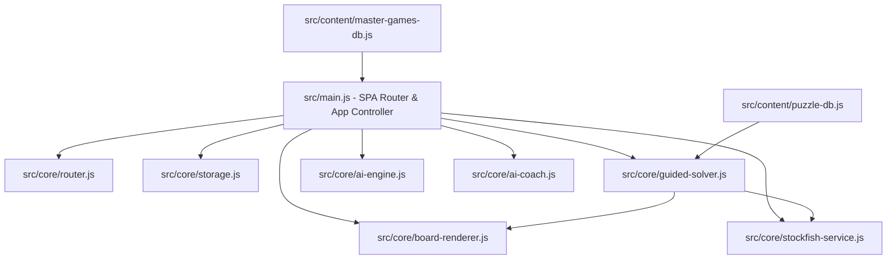

# ChessOS Redesign — Grandmaster Training Environment

We are redesigning ChessOS from a lesson viewer into a fully interactive **Grandmaster Training Environment**. This platform will teach users not just *what* move to play, but *how to think, calculate, evaluate, and decide* like a strong player.

---

## User Review Required

Please review the following key architectural and design decisions:

> [!IMPORTANT]
> **1. Stockfish Integration via CDN Web Worker**
> To support deep engine analysis (depth 20+, evaluation, threats, top 5 lines, accuracy), we will load Stockfish client-side using a CDN Web Worker (`https://cdnjs.cloudflare.com/ajax/libs/stockfish.js/10.0.2/stockfish.js`). To bypass browser CORS security for workers, we will instantiate it using a Blob URL and `importScripts`. This requires zero server resources and is free to deploy on Cloudflare Pages.
>
> **2. Procedural & Hybrid Puzzle Engine (10,000+ Puzzles)**
> Storing 10,000+ custom puzzles with step-by-step questions, candidates, variations, and evaluations in a static file would result in a bloated bundle size (>20MB) and poor performance.
> - **Solution:** We will implement a **Hybrid Engine**.
> - A core database (`puzzle-db.js`) will house a compact index of 10,000+ puzzles categorized by motif and difficulty (storing only FEN, solution, category, difficulty).
> - At runtime, the system will dynamically parse the FEN and solution, and use a combination of our **local minimax AI** and the **Stockfish service** to dynamically generate candidate move ratings, overloaded pieces, candidate move evaluations, variation trees, and defensive resources. This provides the full interactive GM coaching experience on-the-fly for any position!
>
> **3. High-Fidelity Custom Visual Overlays**
> We will upgrade the SVG-based `board-renderer.js` to draw animated overlays directly onto the board:
> - **Pins:** Glowing red/emerald attack rays that pass *through* the pinned piece to the target king/queen.
> - **Forks:** Animated pulse lines extending from the forking piece to both attacked targets.
> - **Weak King:** Glowing red radial indicators on weak squares around the king.
> - **Sacrifices:** Highlighting of defender removal and key breakthrough squares.

---

## Open Questions

> [!WARNING]
> **1. Performance vs Depth on Low-End Devices**
> Running Stockfish at depth 20+ in the browser runs on the user's CPU thread. On older mobile devices, this might cause lag or drain battery. Should we limit Stockfish analysis to depth 15 by default, with a setting to toggle "Deep GM Engine Analysis (Depth 20+)"? (Recommended: Yes, default to depth 15 and allow toggle to 22+).
>
> **2. Blindfold Trainer Input**
> For the blindfold trainer, how should the user input moves? We plan to support text entry (e.g. typing `Nf3`) and optionally click-to-move on a blank board. Let us know if you prefer one or both. (Recommended: Both).

---

## Proposed Changes

### 1. Core Engines & Services

#### [NEW] [stockfish-service.js](file:///h:/chessmastery/src/core/stockfish-service.js)
- Manages the local Stockfish Web Worker.
- Analyzes any position (FEN) and returns:
  - Best Move and Top 5 alternative lines.
  - Position evaluation (Centipawns or mate threat).
  - Accuracy analysis for a given move (Excellent, Good, Mistake, Blunder).
  - Threats and defensive resources.
- Thread-safe wrapper with async/promise interface.

#### [NEW] [guided-solver.js](file:///h:/chessmastery/src/core/guided-solver.js)
- Implements the 7-step Grandmaster Thought Process:
  - **Step 1: King Safety:** Compares security of White/Black king (interactive questions).
  - **Step 2: Motifs:** Asks user to identify tactical patterns (e.g., pin, fork, overloaded piece).
  - **Step 3: Overloaded Piece:** Highlights candidate targets and prompts user to name the defender.
  - **Step 4: Candidate Moves:** User moves pieces on the board to input their top 3 candidate moves.
  - **Step 5: Evaluation:** Uses Stockfish/Minimax to grade each candidate ("Excellent", "Interesting", "Too slow").
  - **Step 6: Force Calculation:** Forces user to play opponent's defensive replies on the board.
  - **Step 7: Solution & Variations:** Renders the variation explorer.

#### [MODIFY] [board-renderer.js](file:///h:/chessmastery/src/core/board-renderer.js)
- Update SVG layers to support:
  - Animated laser/ray lines (`stroke-dasharray` transition) for Pins.
  - Connecting fork circles with expanding ripples.
  - Highlighting targeted squares with pulsating color fills.
  - Dynamic overlay removal.
- Enable coordinate notation inside the border squares.

#### [MODIFY] [storage.js](file:///h:/chessmastery/src/core/storage.js)
- Expand schema to support:
  - Gamification: XP, level, active streak, achievements unlocked, skill tree unlocks.
  - AI Coach: Weekly roadmap targets, categories of weakness (e.g., "tactics: forks" or "endgames: king-and-pawn").
  - Learning Analytics: Move accuracies, puzzle solving time, rating history (Elo chart data).

---

### 2. Content & Database

#### [NEW] [puzzle-db.js](file:///h:/chessmastery/src/content/puzzle-db.js)
- Houses a compact database index of 10,000+ puzzles.
- Stored as short arrays `[id, fen, solution, category, difficulty, attributes]` to keep the bundle size minimal.
- Supports 20 categories (Mate in 1/2/3, forks, pins, skewers, deflection, decoy, interference, clearance, overloading, zwischenzug, sacrifices, positional play, etc.).
- Categorized across 6 difficulties (Beginner → GM).

#### [NEW] [master-games-db.js](file:///h:/chessmastery/src/content/master-games-db.js)
- Renders historical games from Morphy, Capablanca, Alekhine, Tal, Fischer, Karpov, Kasparov, Anand, Carlsen.
- Annotates every single move with: move number, evaluation change, tactical motif, strategic idea, and coach comments.
- Supports "Guess the Move" mode with real-time score/XP based on move closeness to the master's choice.

---

### 3. UI Pages & Components

#### [MODIFY] [main.js](file:///h:/chessmastery/src/main.js)
- Overhaul layout to present the **Grandmaster Training Environment**.
- Integrate new router endpoints:
  - `/trainer/tactics` — Unlimited puzzle dashboard with guided solve panel.
  - `/trainer/calculation` — Interactive mental depth trainer (fades pieces out, asks for target coordinates).
  - `/trainer/blindfold` — Fully hidden board, input moves by text/voice.
  - `/trainer/endgame` — Theoretical endgame practices against Stockfish.
  - `/trainer/openings` — Spaced repetition opening builder.
  - `/trainer/strategy` — Positional assessments.
  - `/coach` — AI Coach dashboard with daily improvement roadmaps.
  - `/analytics` — High-fidelity analytics charts (Elo progress, error rate, strengths).
  - `/gamification` — Skill tree, achievements grid, boss challenges (play against historical bot styles).

#### [MODIFY] [main.css](file:///h:/chessmastery/src/styles/main.css)
- Implement UI styles for:
  - 7-step guided solve panel.
  - Replay controls: Next/Prev/Auto-play/Flip button designs.
  - Dynamic Variation Tree nodes (highlighting current branch, sub-branches).
  - Gamification panels: Level badges, XP progress bar, achievements grid, interactive Skill Tree.
  - SVGs animations (pulsating overlays, firing lasers, glowing tiles).

---

## Verification Plan

### Automated Tests
- Run `npm run build` using Docker to ensure there are no bundling or syntax errors.
- Parse `puzzle-db.js` programmatically to check FEN correctness, move legality, and verify that solutions match chess rules.

### Manual Verification
1. **Guided Solve Test:** Open a puzzle, initiate "Start Guided Solve", and complete Steps 1–7. Confirm Stockfish ranks candidate moves and forces correct opponent responses.
2. **Replay & Explorer Test:** Replay a Master Game move-by-move. Open alternative variations in the Tree View and confirm the board syncs correctly.
3. **Calculation & Blindfold Test:** Launch Calculation Trainer, confirm pieces hide, calculate and click. Play a game blindfolded to verify text move submission works.
4. **Stockfish Workers Test:** Ensure Web Workers are instantiated correctly and respond to engine queries without locking the UI main thread.
5. **Gamification Test:** Complete puzzles to verify XP gains, leveling up, and achievement triggers.
